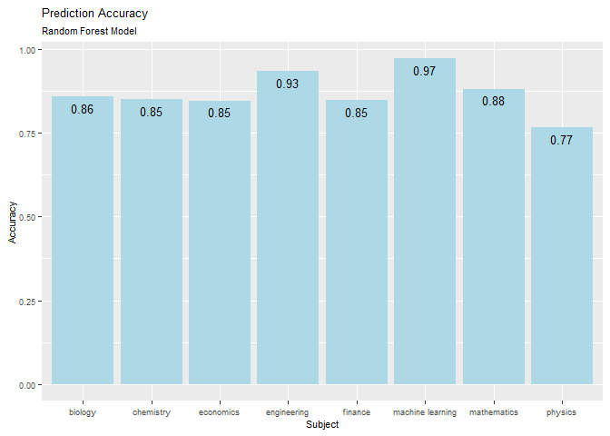
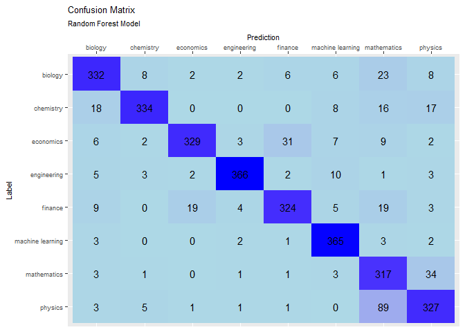

ML Classification of Research
================
Bryan Isaac
1/7/2022

## Pre-processing

``` r
setwd("/Users/bryan/Documents/Grad School/Fall 2021/Econ 630/Labs")

source('/Users/bryan/Documents/Grad School/Fall 2021/Econ 630/Functions/load_NLP_env.R')
load_NLP_env('/Users/bryan/Documents/Grad School/Fall 2021/Econ 630/Functions')
```

    ## 
    ## Attaching package: 'dplyr'

    ## The following objects are masked from 'package:plyr':
    ## 
    ##     arrange, count, desc, failwith, id, mutate, rename, summarise,
    ##     summarize

    ## The following objects are masked from 'package:stats':
    ## 
    ##     filter, lag

    ## The following objects are masked from 'package:base':
    ## 
    ##     intersect, setdiff, setequal, union

    ## Loading required package: NLP

    ## 
    ## Attaching package: 'NLP'

    ## The following object is masked from 'package:ggplot2':
    ## 
    ##     annotate

    ## Loading required package: koRpus.lang.en

    ## Loading required package: koRpus

    ## Loading required package: sylly

    ## For information on available language packages for 'koRpus', run
    ## 
    ##   available.koRpus.lang()
    ## 
    ## and see ?install.koRpus.lang()

    ## 
    ## Attaching package: 'koRpus'

    ## The following object is masked from 'package:tm':
    ## 
    ##     readTagged

    ## [1] "packages loaded:  plyr, dplyr, reshape2, ggplot2, textclean, tm, textstem, Rcpp, text2vec, tidytext"
    ## [1] "functions loaded:  load_NLP_env.R, Pre-process-corpus.R"

``` r
abstracts <- read.csv('/Users/bryan/Documents/Grad School/Fall 2021/Econ 630/Data Files/science_abstracts.csv')

text <- pre_process_corpus(abstracts, "Abstracts", root_gen = 'lemmatize')

abstracts$text_preprocessed <- text

rand <- runif(nrow(abstracts))
sets <- ifelse(rand < 0.8, 'train', 'test')
abstracts$set <- sets 

train <- abstracts[abstracts$set == 'train',]

it_train <- itoken(train$text_preprocessed,
                   tokenizer = word_tokenizer, ids = train$id)
vocab <- create_vocabulary(it_train, ngram = c(1, 3))

lbound <- 20
ubound <- nrow(train) - 20

vocab <- vocab[vocab$doc_count > lbound & vocab$doc_count < ubound,]

vectorizer <- vocab_vectorizer(vocab)
dtm_train <- create_dtm(it_train, vectorizer)

dim(dtm_train)
```

    ## [1] 12383  4789

``` r
test <- abstracts[abstracts$set == 'test',]
it_test <- itoken(test$text_preprocessed,
                  tokenizer = word_tokenizer, ids = test$id)

dtm_test <- create_dtm(it_test, vectorizer)

dim(dtm_test)
```

    ## [1] 3107 4789

## Random Forest Classifier

``` r
library(caret)
```

    ## Loading required package: lattice

``` r
trctrl <- trainControl(method = "repeatedcv", number = 3, repeats = 3)


# RF model
model_rf <- train(as.matrix(dtm_train),
                  y = as.factor(train$Topic),
                  method = "ranger",
                  trControl = trctrl,
                  tuneGrid = data.frame(mtry = floor(sqrt(dim(as.matrix(dtm_train))[2])),
                                        splitrule = "gini",
                                        min.node.size = 1))
```

    ## Growing trees.. Progress: 99%. Estimated remaining time: 0 seconds.
    ## Growing trees.. Progress: 99%. Estimated remaining time: 0 seconds.
    ## Growing trees.. Progress: 96%. Estimated remaining time: 1 seconds.
    ## Growing trees.. Progress: 99%. Estimated remaining time: 0 seconds.
    ## Growing trees.. Progress: 98%. Estimated remaining time: 0 seconds.
    ## Growing trees.. Progress: 99%. Estimated remaining time: 0 seconds.
    ## Growing trees.. Progress: 98%. Estimated remaining time: 0 seconds.
    ## Growing trees.. Progress: 99%. Estimated remaining time: 0 seconds.
    ## Growing trees.. Progress: 98%. Estimated remaining time: 0 seconds.
    ## Growing trees.. Progress: 57%. Estimated remaining time: 23 seconds.

``` r
pred_test <- predict(model_rf, as.matrix(dtm_test))

preds <- data.frame(id = abstracts$X[abstracts$set == "test"], 
                    label = abstracts$Topic[abstracts$set == "test"],
                    rf = as.factor(as.character(pred_test)))

preds$rf_score = ifelse(preds$rf == preds$label, 1, 0)
```

## Results

``` r
accuracy_table <- preds %>% group_by(label) %>% summarize(accuracy = mean(rf_score))
accuracy_table <- data.frame(accuracy_table)

ggplot(accuracy_table, aes(x = label, y = accuracy)) + geom_bar(stat = 'identity', fill = 'lightblue') + 
  geom_text(aes(label = round(accuracy, 2)), vjust = 1.6, size = 3.5) + 
  labs(x = 'Subject', y = 'Accuracy', title = 'Prediction Accuracy', subtitle = 'Random Forest Model') + 
  theme(text = element_text(size = 8))
```

<!-- -->

``` r
confusion_matrix <- table(preds$label, preds$rf)
confusion_matrix <- as.data.frame.matrix(confusion_matrix)

library(tidyverse)
```

    ## Warning: package 'tidyverse' was built under R version 4.1.2

    ## -- Attaching packages --------------------------------------- tidyverse 1.3.1 --

    ## v tibble  3.1.5     v purrr   0.3.4
    ## v tidyr   1.1.4     v stringr 1.4.0
    ## v readr   2.0.2     v forcats 0.5.1

    ## Warning: package 'forcats' was built under R version 4.1.2

    ## -- Conflicts ------------------------------------------ tidyverse_conflicts() --
    ## x NLP::annotate()    masks ggplot2::annotate()
    ## x dplyr::arrange()   masks plyr::arrange()
    ## x purrr::compact()   masks plyr::compact()
    ## x dplyr::count()     masks plyr::count()
    ## x dplyr::failwith()  masks plyr::failwith()
    ## x dplyr::filter()    masks stats::filter()
    ## x dplyr::id()        masks plyr::id()
    ## x dplyr::lag()       masks stats::lag()
    ## x purrr::lift()      masks caret::lift()
    ## x dplyr::mutate()    masks plyr::mutate()
    ## x dplyr::rename()    masks plyr::rename()
    ## x dplyr::summarise() masks plyr::summarise()
    ## x dplyr::summarize() masks plyr::summarize()
    ## x readr::tokenize()  masks koRpus::tokenize()

``` r
heat_map <- confusion_matrix %>% rownames_to_column() %>% gather(colname, value, -rowname)

ggplot(heat_map, aes(x = colname, y = rowname, fill = value)) + geom_tile() + geom_text(aes(label = value)) + 
  scale_y_discrete(limits = rev) + scale_x_discrete(position = 'top') + 
  scale_fill_gradient(low = "lightblue", high = "blue", space = "Lab") + 
  labs(x = 'Prediction', y = 'Label', title = 'Confusion Matrix', subtitle = 'Random Forest Model') +
  theme(legend.position = "none", text = element_text(size = 8))
```

<!-- -->
